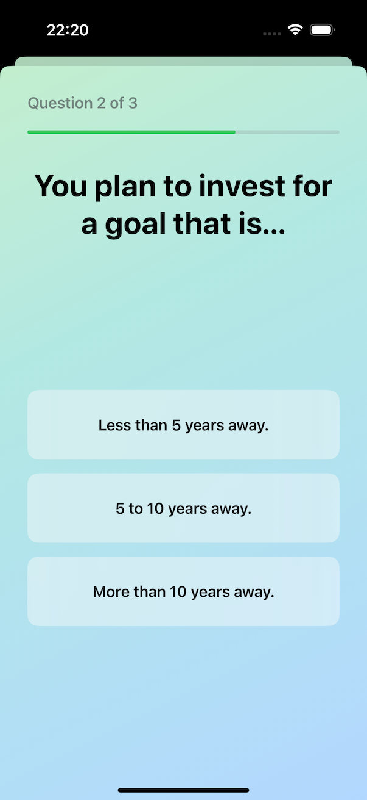
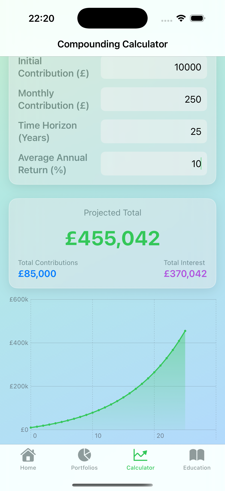
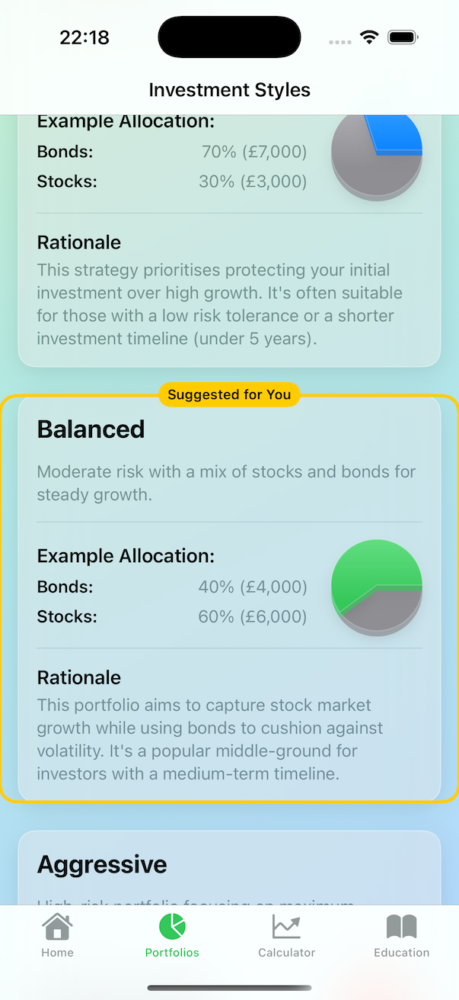

# ISA Assistant 🍃

**Your friendly guide to understanding ISAs, finding your investment style, and visualizing your financial future.**

 

)

---

ISA Assistant turns the confusion of saving and investing into confidence. Built with a clean, simple interface, our app helps you learn, plan, and grow your money with powerful tools and easy-to-understand guides.

 

## Key Features

### ✨ Find Your Investment Style
Not sure if you're a cautious saver or a growth-focused investor? Take our simple, friendly quiz to get a personalized suggestion for the portfolio style that might be right for you.

### 📈 Visualize Your Future
Our powerful and instant compounding calculator shows you exactly how your savings can grow over time. The interactive chart makes it easy to see the long-term impact of your contributions.

### 📊 Explore Portfolio Examples
See clear examples of different investment portfolios, from Conservative to Aggressive. Understand the strategy and asset mix behind each one with beautiful 3D pie charts.

---

### Download Today

Ready to start your journey to a smarter financial future?

)

 

# Privacy Policy for ISA Assistant

**Last Updated:** August 22, 2025

Thank you for using ISA Assistant. This privacy policy explains our practices regarding data.

## Data Collection

ISA Assistant does not collect, store, transmit, or share any personal data from its users. 

All data entered into the application, such as values for the compounding calculator or the ISA allowance tracker, is stored locally on your device only. This data is not accessible to us or any third parties.

## Contact Us

If you have any questions about this Privacy Policy, you can contact us at:

* **Email:** msavchenko@hotmail.com

---
## Support

For any questions, bug reports, or support requests, please contact us at:

* **Email:** msavchenko@hotmail.com
